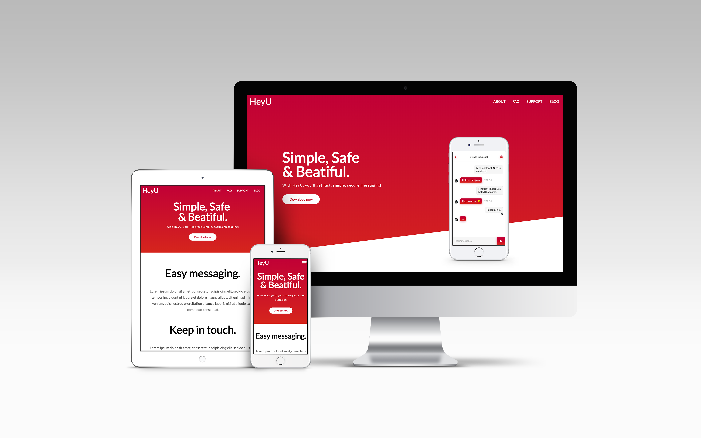

# HeyU Template
>The task of that project is to convert [PSD Template](https://symu.co/freebies/templates-4/heyu-psd-template/) into website
>
## Preview

---
### How to run this project?
Just clone this repository into any directory and open "index.html" file
or just simply [see](https://p1xar.github.io/HeyU_Template) online

### Contribution
Contributions are always **welcome and recomended**. Here is how:
* Fork a repository ([here's how](https://help.github.com/en/articles/fork-a-repo));
* Clone to your directory ```https://github.com/p1xar/HeyU_Template```;
* Make a changes;
* Create a pull request.
### Background
I wanted to practice my layout skills, so I've choosen this [PSD template](https://p1xar.github.io/HeyU_Template) as a basis to my website. This template, unfortunatelly, didn't have a mobile version, so I made my own vision on how the website would look on mobile phones and tablets. This projects doesn't have any pre-processors, package managers etc., because it's quite simple and there is no need to make it more complex than it is.
### What technologies used in this project?
* HTML 5;
* CSS 3;
* Vanilla JS (non-strict);
* jQuery v2.1.3;
* Flexbox.
### Goals
* Minimize css;
* Make correct display for widescreen monitors;
* Add smooth scrolling on nav elements click;
* Make more animations.

